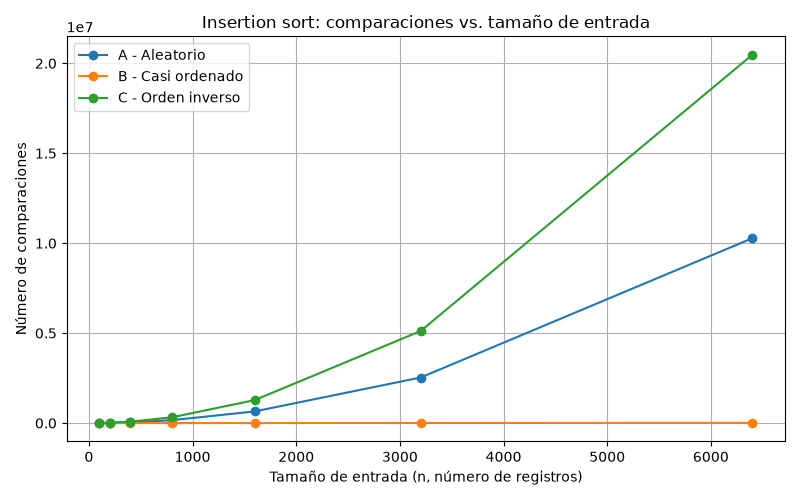
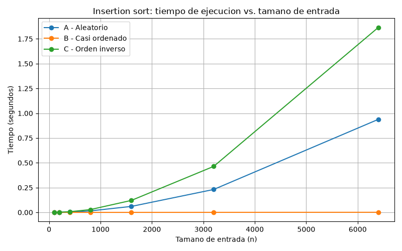
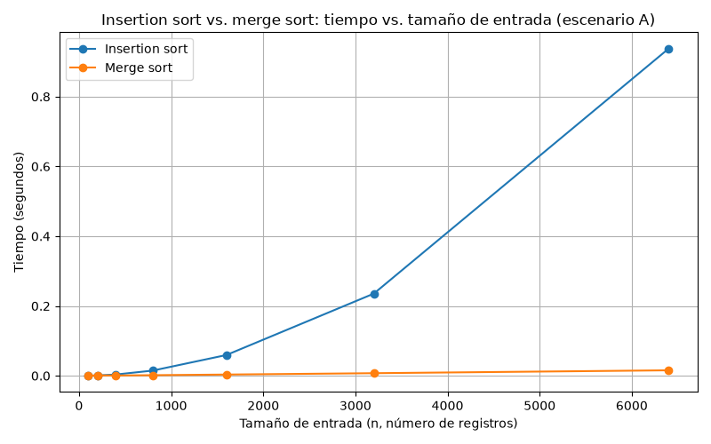

# Laboratorio 1 — Fundamentos de complejidad y recurrencias

Samuel Arango Montoya

## Instrucciones para reproducir el experimento

1. Abra una terminal en la carpeta `laboratorios/lab1-fundamentos-complejidad-recurrencias`.
2. Cree y active el entorno virtual **en una ruta corta, fuera de la carpeta del proyecto** (evita el error de rutas largas de Windows, `WinError 206`):

```bash
python -m venv C:\venvs\lab1
C:\venvs\lab1\Scripts\activate
pip install matplotlib
```

En PowerShell, la activación es `C:\venvs\lab1\Scripts\Activate.ps1`.

> **Nota (Windows):** si `pip install` falla con `WinError 206`, la ruta del entorno es demasiado larga.

> Cree el entorno más cerca de la raíz del disco, como en el comando anterior.

3. Ejecute cada parte:

```bash
python parte3_casos.py        # genera graficas/parte3_comparaciones.png y graficas/parte3_tiempo.png
python parte4_complejidad.py  # genera graficas/parte4_tiempo.png
```

## Parte 1 — Analizar el algoritmo antes de comprar hardware

La corrección y eficiencia son propiedades distintas, un algoritmo es correcto si su salida es la esperada, en este caso, insertion sort ordena bien los 1.200.000 registros de mayor a menor riesgo. En cambio, es eficiente respecto al tiempo si termina dentro de la ventana del sistema de 2:00 a.m. a 6:00 a.m. , para que el centro de contacto abra con la lista completa. Esa ventana de cuatro horas es la restricción que Tamiza incumple, Tamiza cumple lo primero y ha incumplido lo segundo, cuando el centro trabajó con una lista parcial y sin ordenar. Entonces vemos que la corrección no garantiza la eficiencia porque no dice cuánto trabajo demanda llegar al resultado.

El trabajo de insertion sort en el caso promedio y en el peor caso crece con  la cantidad de datos al cuadrado, porque cada registro nuevo se compara contra la mayoria de los que ya están ordenados. Si los datos se duplican, el tiempo no se duplica, se multiplica por 4. Hace ocho años había unos 20.000 registros, hoy hay 1.200.000, es decir, 60 veces la cantidad de datos, y el tiempo se multiplica por 60² = 3.600.

Por eso duplicar la velocidad del servidor no resuelve el problema de lleno. Hoy el proceso tarda X horas, con X > 4, y un servidor el doble de rápido lo dejaría en X/2 ,eso resolvería el desborde actual, si X/2 fuera menor a 4 horas. Pero el programa seguirá creciendo, igual que pasó de 20.000 a 1.200.000 registros en ocho años. Cuando el volumen vuelva a duplicarse, insertion sort no tarda el doble, tarda 4 veces más, porque el trabajo depende del tamaño al cuadrado. Ese día el mismo servidor , con su ganancia fija de 2, tardaría (X/2) × 4 = 2X, significa que se volvería a exceder la ventana, ahora por el doble de margen. El hardware nos ofrece un beneficio constante que el crecimiento cuadrático del algoritmo termina por sobrepasar, por eso el servidor nuevo solo pospone el problema hasta el próximo crecimiento del volumen.

Un segundo ejemplo lo viví en mis prácticas en Colcafé. Desarrollé un script de Google Apps Script que consolidaba en un Sheet maestro los datos de 15 áreas. El maestro acumulaba el historial, aproximadamente 20.000 a 30.000 filas, que iban modificándose regularmente y cada día entraban unos 250 a 300 registros nuevos. El script producía el resultado correcto, pero en cada ejecución recorría el maestro leyendo y escribiendo celda por celda, y cada acceso es una llamada al servicio de Google. El proceso tardaba entre 5 y 6 minutos, pegado al límite de 6 minutos de Apps Script, y con el crecimiento del historial iba a superarlo y dejar el maestro incompleto para el informe mensual, al igual que en Tamiza, el resultado era correcto y lo que fallaba era la restricción de tiempo. 


## Parte 2 — Responsabilidad ambiental y ética de la implementación

### Dimensión ambiental

Cada operación del procesador consume energía, así que el tiempo de ejecución no es solo velocidad, es tiempo de servidor a alta exigencia, más la energía que se requiere para refrigerarlo. Un servidor de unos 400 W mínimos para esta tarea, con cuatro horas de ejecución que equivalen a 1,6 kWh por noche. Repetido durante 365 madrugadas, son aproximadamente 584 kWh al año sin contar la refrigeración. Y si el proceso se desborda y no termina, esa energía se gastó igual y entregó una lista inservible.

El desperdicio está en el trabajo repetido, no en la falta de potencia. Insertion sort compara cada registro contra la mayoría de los que ya ordenó, así que al crecer los datos, el número de comparaciones crece mucho más rápido que el número de registros. Cada una de esas comparaciones mantiene el procesador ocupado y por ende consumiendo energía. Un algoritmo que haga menos trabajo por registro reduce el consumo eléctrico en cada madrugada, durante años. En cambio, comprar un servidor más potente pospone el problema y cuando el volumen vuelva a crecer necesitará otro reemplazo, contribuyendo así a la fabricación y desecho de equipos.

### Dimensión ética

Tenemos un paciente de alto riesgo, con índice 950 y valores de laboratorio muy alterados. Si el proceso no termina y el centro usa una lista parcial y sin ordenar, ese paciente queda mezclado con los de riesgo bajo o fuera de la lista y su valoración se aplaza días. El primer afectado es él en su salud, sin saber que la lista falló. Después lo asume la Secretaría, que debe responder institucional y legalmente por un programa que no cumplió su propósito de llegar primero a los más graves.

También contemplamos a la operadora del centro de contacto. Ella llama siguiendo la lista y no puede verificar si está bien ordenada. Si un paciente grave no fue contactado, recibe el reclamo de la familia y carga con la negligencia, aunque el fallo ocurrió en pasos anteriores. Ella asume el desgaste y el señalamiento y la Secretaría el desprestigio. Pero quien debería asumir el error es el equipo de desarrollo, que mantuvo un algoritmo sin revisar cómo se comportaba al crecer los datos. 

Como el orden decide a quién se llama primero, la corrección no se limita a terminar a tiempo, impone tres obligaciones. Primero, verificar la salida, la lista debe estar realmente ordenada de mayor a menor y contener exactamente los mismos registros que la entrada, ninguno perdido ni repetido. Segundo, avisar si el proceso no termina antes de las 6:00 a. m., con una alerta a una persona responsable, para que el centro sepa que su lista es parcial en vez de creer que es la correcta. Tercero, resolver los empates, el índice toma valores entre 0 y 1000, así que con 1.200.000 registros habrá muchos pacientes con el mismo índice. El criterio de desempate debe ser estable, de modo que los empates conserven su orden de llegada y ningún paciente quede atrás porque el algoritmo lo saltó. 


## Parte 3 — Peor caso, mejor caso y caso promedio

Código de esta parte: [parte3_casos.py](parte3_casos.py). Usa [algoritmos.py](algoritmos.py) y [datos.py](datos.py).

### 3.1 — Explicación y predicción

Los tres casos se aplican sobre el mismo conjunto, con todas las entradas posibles de tamaño fijo n. Se recorren todas las permutaciones posibles de n elementos.

Peor caso: para un tamaño n fijo, es el máximo del número de comparaciones entre todas las permutaciones posibles de n elementos. Es decir, todas las formas en que podrían llegar n registros, la que más trabajo le exige al algoritmo. Para insertion sort, ese máximo se alcanza cuando la entrada está en orden contrario al que se busca, porque cada elemento nuevo hay que compararlo contra todos los que ya están antes de encontrar su lugar.

Mejor caso: para el mismo tamaño n, es el mínimo del número de comparaciones entre esas mismas n! permutaciones. Para insertion sort ocurre cuando la entrada ya llega ordenada, cada elemento nuevo se compara una sola vez contra el anterior y no necesita moverse.

Caso promedio: para el mismo n, es el promedio del número de comparaciones tomado sobre todas las permutaciones posibles, cada una con la misma probabilidad de ocurrir. No es un caso típico elegido a ojo, es sumar el trabajo que exige cada una de las n! entradas posibles y dividir entre n!.

### ¿Cuál usar para decidir si Tamiza entra en producción?

El peor caso, la ventana de cuatro horas no es una meta a la que se aspira en promedio, es un límite que no se puede cruzar ni una sola madrugada. Si Tamiza se pone en producción basándose en que en promedio cabe en la ventana, se está aceptando que hay grupos de entrada , que son los más perjudiciales y con los que el proceso sí se desborda. Y eso es justo lo que ya pasó tres veces, no hace falta que todas las madrugadas fallen para que el sistema sea inviable, basta con que falle cuando le toque una entrada cercana al peor caso. 

### Predicción antes de medir

Antes de correr el experimento, mi predicción para insertion sort sobre los tres escenarios de Tamiza es:

Escenario C (orden inverso) es el peor caso,los registros llegan al revés de cómo se necesitan, así que cada inserción tiene que recorrer todo el segmento ya ordenado.

Escenario B (casi ordenado) es el mejor caso, la mayoría del lote ya viene ordenado de la ejecución anterior, y una mínima parte final necesita reubicarse, así que la mayoría de las inserciones deberían tomar muy pocas comparaciones.

Escenario A (aleatorio) debería quedar en algún punto intermedio, más cerca del caso promedio, porque no tiene ninguna estructura que ayude o perjudique al algoritmo.


### 3.2 — Demostración experimental






Las mediciones confirman exactamente la predicción hecha en 3.1, sin contradicciones que explicar.

Peor caso: Escenario C (orden inverso). Como se ve en parte3_comparaciones.png y parte3_tiempo.png, C es la curva que crece más rápido en ambas gráficas, para n=6400 alcanza cerca de 20,5 millones de comparaciones y 1,87 segundos, muy por encima de los otros dos escenarios. Esto confirma la predicción, al llegar los datos en el orden exactamente contrario al que insertion sort produce, cada nuevo elemento debe compararse contra todos los que ya están ordenados antes de encontrar su lugar, lo que genera el número máximo de comparaciones posible para cada tamaño n.

Mejor caso: Escenario B (casi ordenado). En ambas gráficas, la curva de B se mantiene pegada a cero en todo el rango de tamaños medidos, incluso en n=6400. Esto confirma la predicción, como el 98% del lote ya llega ordenado, la gran mayoría de las inserciones solo necesitan una comparación, y solo el 2% requiere desplazamientos.

Aproximación al caso promedio: Escenario A (aleatorio). Tal como se predijo, quedó en un punto intermedio entre B y C en ambas gráficas, para n=6400 registra cerca de 10,3 millones de comparaciones y 0,95 segundos, casi la mitad de lo que exige C. Esto confirma que una entrada sin ninguna estructura particular se comporta como cualquier otra permutación aleatoria de los n elementos.

Precisión sobre el escenario B: es el escenario más cercano al mejor caso, pero no es exactamente el mejor caso. El mejor caso es la lista ya completamente ordenada, que para n = 6.400 exige n − 1 = 6.399 comparaciones, y B hizo 10.277. Además, mi generador deja al final el 2 % con los índices más pequeños, como la lista se ordena de mayor a menor, esos registros ya pertenecen al final y solo se reordenan entre sí. Si los registros nuevos del día tuvieran índices repartidos en todo el rango, cada uno tendría que recorrer buena parte de la lista ya ordenada, una estimación es 0,02·n · n/2 = 0,01·n² ≈ 410.000 comparaciones para n = 6.400. Sería unas 40 veces más que mi B, aunque todavía mucho menos que las 10,3 millones de A. Por eso B debe leerse como un límite optimista del reproceso.

Conclusión del contraste: el experimento no contradijo la predicción de 3.1 en ningún punto. se cumple para los siete tamaños medidos, y la forma de las curvas es consistente con el comportamiento teórico de insertion sort, Θ(n²) en el peor y el caso promedio, y Θ(n) en el mejor caso.


## Parte 4 — Complejidad de merge sort e insertion sort

Código de esta parte: [parte4_complejidad.py](parte4_complejidad.py). Usa [algoritmos.py](algoritmos.py).

### 4.1 — Cálculo teórico

#### Planteamiento de la recurrencia de merge sort

T(n) = 2T(n/2) + Θ(n)

Cada término sale directamente de cómo merge_sort divide el problema:

2T(n/2): la función _merge_sort divide la lista en dos mitades (sub[:medio] y sub[medio:], con medio = len(sub) // 2) y se llama ella misma recursivamente sobre cada mitad. Son 2 subproblemas, cada uno de tamaño n/2. Por eso el coeficiente es 2 y el tamaño del subproblema es n/2.

Θ(n): después de que las dos llamadas recursivas devuelven sus mitades ya ordenadas, la función _merge las combina en una sola lista de tamaño n. Esa combinación recorre cada uno de los n elementos exactamente una vez, sin importar cómo estén distribuidos los datos entre las dos mitades.

#### Resolución por árbol de recursión

cada nodo representa una llamada recursiva, con el costo de combinar en ese nivel,no el costo total acumulado:
```text
Nivel 0:                    T(n)                          costo: cn
                          /      \
Nivel 1:            T(n/2)        T(n/2)                  costo: c(n/2) + c(n/2) = cn
                    /    \          /    \
Nivel 2:        T(n/4) T(n/4)   T(n/4) T(n/4)              costo: 4·c(n/4) = cn
                  ...                                       ...
Nivel k:    T(n/2^k)  T(n/2^k) ...  (2^k nodos)             costo: 2^k · c(n/2^k) = cn
                  ...                                       ...
Nivel log2(n):  T(1) T(1) T(1) ... (n nodos)                costo: n · c(1) = cn  (caso base)
```

Costo por nivel: en cada nivel k hay 2^k subproblemas, cada uno de tamaño n/2^k. El costo de combinar en ese nivel es 2^k · c·(n/2^k) = c·n. Es decir, cada nivel del árbol cuesta lo mismo: cn, sin importar en qué nivel esté.

Número de niveles: el árbol empieza en tamaño n y termina cuando el subproblema llega a tamaño 1 , es decir, cuando n/2^k = 1, o sea k = log₂(n). Como el árbol arranca en el nivel 0, el número total de niveles es log₂(n) + 1.

Costo total: se suma el costo de todos los niveles:
```text
Costo total = (número de niveles) × (costo por nivel)
            = (log₂(n) + 1) × cn
            = c·n·log₂(n) + c·n
```
El término dominante es c·n·log₂(n), y el término c·n queda absorbido por él para n grande. Por lo tanto:

T(n) = Θ(n log n)

#### Cota de insertion sort, calculada línea por línea

Se toma como referencia la implementación real en algoritmos.py:

```python
def insertion_sort(datos: list[int]) -> tuple[list[int], int]:
    lista = datos.copy()                          # línea A
    comparaciones = 0                              # línea B

    for i in range(1, len(lista)):                 # línea C
        clave = lista[i]                            # línea D
        j = i - 1                                   # línea E
        while j >= 0:                               # línea F
            comparaciones += 1                       # línea G
            if lista[j] < clave:                     # línea H
                lista[j + 1] = lista[j]                # línea I
                j -= 1                                  # línea J
            else:
                break                                   # línea K
        lista[j + 1] = clave                         # línea L

    return lista, comparaciones                    # línea M
```

Conteo de ejecuciones, en el peor caso:

| Línea | Se ejecuta | Veces (peor caso) |
|---|---|---|
| A, B | una vez | 1 |
| C | una vez por iteración del for | n − 1 |
| D, E | una vez por iteración del for | n − 1 |
| F | condición del while: en cada vuelta del for se evalúa i veces como verdadera y 1 vez como falsa (j = −1) | n(n−1)/2 + (n−1) |
| G, H | una vez por cada vuelta del while | n(n−1)/2 |
| I, J | cada vez que H es verdadera, que en el peor caso es siempre | n(n−1)/2 |
| K | solo cuando H es falsa; en el peor caso nunca ocurre | 0 |
| L | una vez por iteración del for | n − 1 |
| M | una vez | 1 |

Suma de costos:

```text
T(n) = cA + cB + cM
     + (cC + cD + cE + cL)·(n−1)
     + cF·[n(n−1)/2 + (n−1)]
     + (cG + cH + cI + cJ)·n(n−1)/2
```

El peor caso ocurre cuando la lista viene en el orden contrario, que es el escenario C de Tamiza. Aquí cX es el costo constante de ejecutar una vez la línea X. Al expandir n(n−1)/2 = (n² − n)/2, el coeficiente de n² es una constante positiva. Los demás términos son de grado 1 o constantes y quedan absorbidos cuando n crece. Por lo tanto:

T(n) = Θ(n²) en el peor caso.

El mejor caso ocurre cuando la lista ya viene en el orden que el algoritmo produce. Entonces, en cada vuelta del for, la condición lista[j] < clave es falsa de inmediato, las líneas F, G y H se ejecutan una vez por vuelta,n − 1 en total, la línea K se ejecuta n − 1 veces, y las líneas I y J no se ejecutan nunca. Todas las líneas quedan en un número de ejecuciones proporcional a n, así que:

T(n) = Θ(n) en el mejor caso.

En el caso promedio, cada elemento nuevo se espera que recorra, en promedio, la mitad de los elementos ya ordenados antes de encontrar su lugar, lo que mantiene el término dominante en n(n−1)/4, todavía cuadrático en n:

T(n) = Θ(n²) en el caso promedio.

#### Tabla de complejidades esperadas

| Algoritmo | Mejor caso | Caso promedio | Peor caso |
|---|---|---|---|
| Insertion sort | Θ(n) | Θ(n²) | Θ(n²) |
| Merge sort | Θ(n log n) | Θ(n log n) | Θ(n log n) |

Merge sort tiene la misma cota en los tres casos porque su recurrencia no depende del orden de la entrada, siempre divide la lista por la mitad y siempre mezcla recorriendo los n elementos. Lo que sí puede variar entre escenarios es la constante, porque el número de comparaciones dentro de la mezcla depende de cómo varíen los datos y eso se comprueba en la tabla de 4.2, donde merge sort se midió en los tres escenarios.


### 4.2 — Validación experimental



En parte4_tiempo.png se observan dos comportamientos claramente distintos a medida que crece el tamaño de entrada. La curva de insertion sort se mantiene casi plana hasta n=800, pero a partir de ahí empieza a curvarse hacia arriba cada vez más, pasa de aproximadamente 0,06 s en n=1600 a 0,24 s en n=3200 y a 0,94 s en n=6400. Es decir, al duplicar el tamaño de entrada de 3200 a 6400, el tiempo no se duplicó sino que se multiplicó por aproximadamente 4. La curva de merge sort, en cambio se mantiene pegada al eje horizontal en todo el rango medido, terminando en apenas cerca de 0,016 s en n=6400, un valor mnucho menor que el de insertion sort para ese mismo tamaño.

Conclusión: merge sort es el mejor algoritmo para Tamiza, y esta conclusión se lee directamente en la gráfica, para el mismo tamaño de entrada n=6400, merge sort resuelve el ordenamiento en una fracción del tiempo que necesita insertion sort, y esa ventana se agranda a medida que crece n, en vez de mantenerse constante.

Esto coincide con las complejidades calculadas en 4.1, insertion sort es Θ(n²) en el caso promedio ,mientras que merge sort es Θ(n log n) en cualquier escenario. La curva empinada de insertion sort es la forma visual del término n², y la curva casi plana de merge sort es la manifestación de n log n, que crece mucho más lento que n² para grandes valores de n.

Para los tamaños pequeños ,ambas curvas se ven casi indistinguibles de cero. Esto no contradice la teoría, para n pequeño el tiempo real está determinado por constantes de overhead ,más que por el término asintótico dominante, así que la diferencia entre Θ(n²) y Θ(n log n) todavía no alcanza a notarse en la escala de segundos. Solo se vuelve visible cuando n crece lo suficiente para que el término dominante supere ese overhead constante.


**Merge sort e insertion sort en los tres escenarios (n = 6.400).** Salida de `python parte4_complejidad.py`, sección "Comparativa por escenario":

| Escenario | Comparaciones insertion sort | Comparaciones merge sort | Tiempo insertion sort (s) | Tiempo merge sort (s) |
|---|---|---|---|---|
| A - Aleatorio | 10.276.753 | 72.967 | 0,9561 | 0,0163 |
| B - Casi ordenado | 10.277 | 39.807 | 0,0018 | 0,0107 |
| C - Orden inverso | 20.476.800 | 41.984 | 1,8457 | 0,0114 |

Las comparaciones son deterministas, así que deben coincidir exactamente con la corrida. Insertion sort varía unas 2.000 veces entre su mejor y su peor escenario ,10.277 frente a 20.476.800. Merge sort varía menos de 2 veces ,39.807 frente a 72.967.

### 4.3 — Concepto técnico a la Secretaría de Salud

**Concepto técnico: elección del algoritmo de ordenamiento para la plataforma Tamiza**

Recomendación: merge sort, ejecutado sin importar el canal de origen. El equipo mencionó que no quiere mantener tres implementaciones distintas para los tres canales de entrada, y esa restricción es la que determina la recomendación. Insertion sort solo es competitivo cuando la entrada llega casi ordenada, en los otros dos canales, su tiempo se dispara. Merge sort, en cambio, es poco sensible al orden de llegada, con n = 6.400 su tiempo fue 0,0163 s en A, 0,0107 s en B y 0,0114 s en C , mientras que insertion sort pasó de 0,0018 s en B a 1,8457 s en C, unas 1.000 veces más. Insertion sort solo gana en B, por milisegundos y eso no compensa mantener dos implementaciones. Su recurrencia divide el arreglo por la mitad y combina recorriendo todos los elementos una vez, sin que el orden de llegada cambie ese trabajo. Esto significa que un único algoritmo cubre los tres canales sin necesidad de detectar cuál es el canal de origen antes de decidir qué ordenamiento aplicar.

Estimación para 1.200.000 registros, esto es una extrapolación a partir de mis mediciones, no una medición directa sobre el volumen real. Partimos de los tiempos de parte4_tiempo.png en n = 6.400: insertion sort 0,94 s y merge sort 0,016 s. Insertion sort crece con n², así que el factor es (1.200.000 / 6.400)² = 187,5² ≈ 35.156 y el tiempo estimado es 0,94 × 35.156 ≈ 33.000 s ≈ 9,2 horas, no cabe en la ventana de 4 horas. Merge sort crece con n log n, así que el factor es 1.200.000 · log₂ 1.200.000 / (6.400 · log₂ 6.400) = 187,5 × (20,19 / 12,64) ≈ 300 y el tiempo estimado es 0,016 × 300 ≈ 4,7 s, cabe de sobra. La estimación se hizo en un solo equipo, las curvas conservan su forma al crecer 187 veces y no incluye efectos de memoria caché ni del servidor real.

Sobre la propuesta de duplicar la velocidad del servidor, con la estimación anterior, un servidor el doble de rápido llevaría insertion sort de unas 9,2 h a unas 4,6 h, todavía por encima de la ventana y sin margen para crecer. El dato de parte4_tiempo.png para n = 6.400 muestra que merge sort 0,016 s es unas 60 veces más rápido que insertion sort 0,94 s y ese cociente aumenta con n, mientras que el servidor aporta un factor fijo de 2. 

Consideración adicional: memoria. Merge sort no ordena en el mismo espacio que ocupa la lista original, cada llamada a _merge construye una lista nueva del tamaño de las dos mitades combinadas, además de las copias sub[:medio] y sub[medio:] que se generan en cada nivel de la recursión. Esto significa que en el peor momento de la ejecución, Tamiza necesitaría memoria adicional del orden del tamaño del lote completo, que son 1.200.000 de registros, mientras que insertion sort ordena sobre una sola copia sin esa sobrecarga. Para 1.200.000 enteros esto no representa un problema serio en un servidor de producción moderno, pero es un costo real que vale la pena verificar contra la memoria disponible antes de desplegar el cambio.
